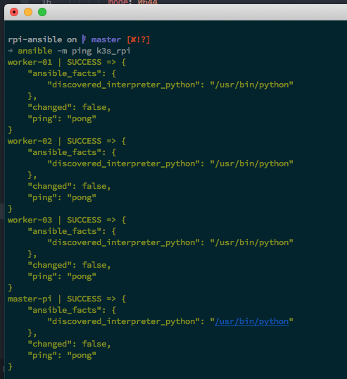
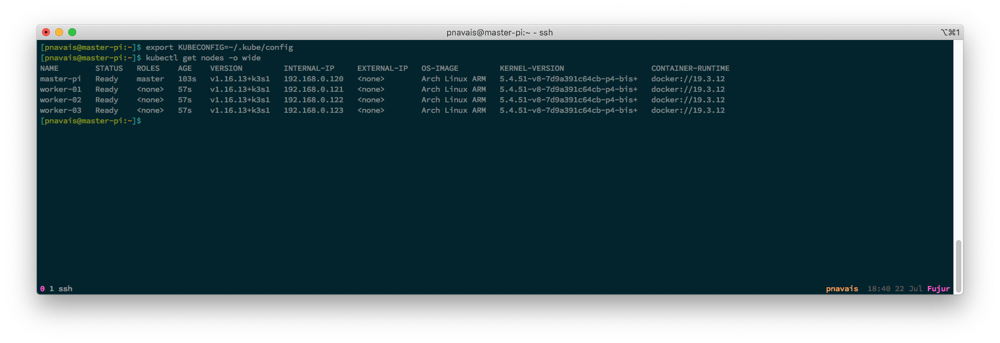

# rpi4-ansible


Ansible config &amp; playbooks for Raspberry pi 4 K3S cluster

## Rationale
This project contains Ansible playbooks allowing to provision from the ground up a K3S cluster of Raspberry Pi 4 based on ArchLinux ARM with both 64-bit Kernel and userland (see [rpi4-arch](https://github.com/pnavais/rpi4-arch) for OS installation).


## How to use it

### Configure the cluster
Modify the file inventory hosts file `inventory/hosts.inv` with the configuration (ip addresses/hosts) to suit your needs.  

The default configuration is based on 4 workers : 
```YAML
[k3s_rpi:children]
k3s_rpi_master
k3s_rpi_workers
 
[k3s_rpi_master]
master-pi ansible_host=192.168.0.120

[k3s_rpi_workers]
worker-01 ansible_host=192.168.0.121
worker-02 ansible_host=192.168.0.122
worker-03 ansible_host=192.168.0.123
```

To check everything is working fine execute : 

```
> ansible -m ping k3s_rpi
```

Which should acknowledge with something similar to : 



Modify the hosts configuration variables file `inventory/group_vars/k3s_rpi.yml` to change default user information (`dev_user`) and custom configuration (e.g. Timezone, preferred static IP addresses, ...).

### Pre-requirements
Provided a sane environment with Python3/pip/Ansible already in place, install external roles from galaxy by executing : 

```
> ansible-galaxy install -r requirements.yml
```

### Execute the Preparation playbooks
The following command with launch the provisioning playbooks :

```
> ansible-playbook playbooks/main.yml
```

which will execute in order: 
1. prepare-system : Performs basic ArchLinux customizations (NTP, GPIO/I2C rules, Yay...) and system packages installation (avahi, docker, ...)
2. setup-packages : Installs auxiliary system packages (Pacman & AUR) and Python modules.
3. setup-users : Create users & groups and download custom [dotfiles](https://github.com/pnavais/dotfiles)
4. network : Setup network settings (hostname, static IP, MDNS, ...)

After successful execution the system will be ready for K3S setup.

### Execute the K3S playbook
In order to install and setup K3S in both master and worker hosts execute the following sensible playbook : 

```
> ansible-playbook playbooks/k3s-setup.yml
```

After a couple of minutes, we should have a working Kubernetes cluster up and running : 



## Auxiliary utilities

### Shutting down the cluster
Execute the following playbook : 

```
> ansible-playbook playbooks/shutdown.yml
```

The shutdown process will start with worker nodes and end up with the master host. This allows to visually display some info in the LCD display and LED before shutdown.

### Uninstalling K3S the cluster
Execute the following playbook :

```
> ansible-playbook playbooks/k3s-reset.yml
```

This stops K3S services and remove dependencies from all hosts.
